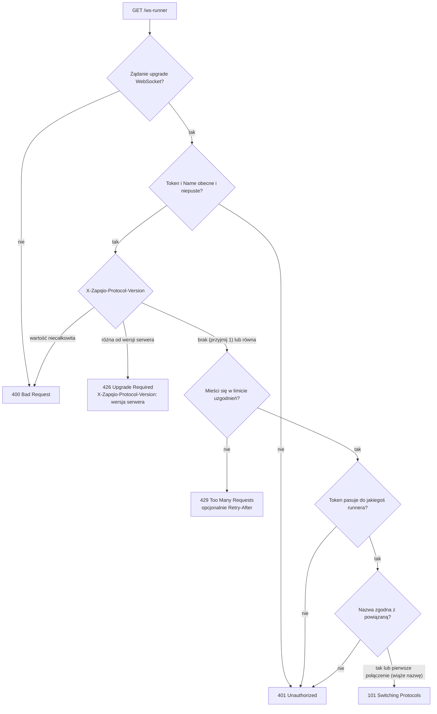
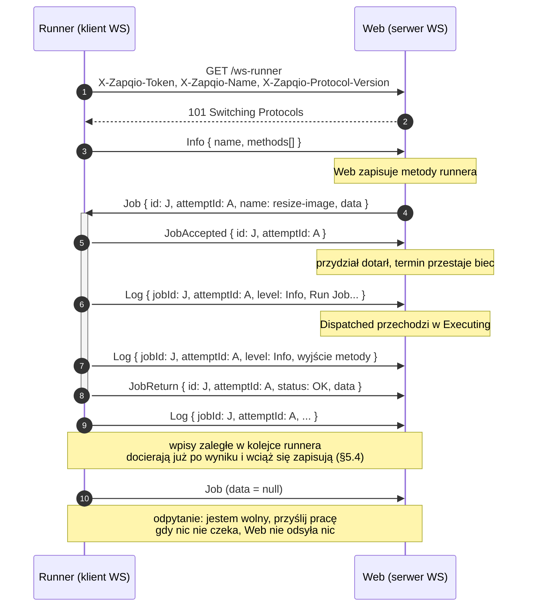

# Protokół Zapqio Runner

To jest **źródło prawdy** dla protokołu komunikacji między serwerem **Web** Zapqio a **Runnerem**.
Każdy runner — w dowolnym języku — który jest zgodny z tym dokumentem, może połączyć się z Web.

---

## 1. Przegląd

To jest **v2** protokołu — wersja główna, którą runner deklaruje przy uzgadnianiu połączenia (§3), a
której zasady podnoszenia opisuje §9.

**Runner** jest **klientem** WebSocket. **Web** jest **serwerem** WebSocket. Runner nawiązuje
połączenie, uwierzytelnia się nagłówkami HTTP, ogłasza metody, które potrafi wykonać, a następnie
odbiera zadania, potwierdza ich odbiór, wykonuje je, strumieniuje logi i zwraca wyniki. Każda
wiadomość aplikacyjna to tekstowa ramka JSON o wspólnej [kopercie](#4-koperta).

Web nie wie, jak runner wykonuje zadanie ani w jakim języku jest napisany — i nie musi. Kieruje
zadania po **nazwie runnera i nazwie metody**, a wejście i wyjście przekazuje dalej jako **zwykły
ciąg znaków**, nie zaglądając do środka. Dlatego jeden pipeline może łączyć kroki z różnych runnerów,
każdy napisany w innym języku.

Kompletna implementacja runnera to trzy warstwy, ale **tylko pierwsza przekracza granicę języka**:

1. **Protokół** — ten dokument. (Do zaimplementowania ponownie w Twoim języku.)
2. **Host** — cykl życia połączenia, pętla zadań, kolejka logów, kierowanie po nazwie metody.
3. **Model modułów** — sposób, w jaki *Twój* język definiuje i wykonuje metody. To projektujesz sam
   (np. dekoratory + generator JSON Schema). Model .NET oparty na `IRunnerMethod` i ładowaniu
   assembly **nie jest przenośny**; moduły są specyficzne dla języka.

Wzmianki o **runnerze referencyjnym** w dalszych sekcjach dotyczą implementacji .NET z
[`github.com/zapqio/runner-dotnet`](https://github.com/zapqio/runner-dotnet) — jedynego działającego
przykładu klienta tego protokołu. Jest ona **jedną** z implementacji, a nie definicją protokołu:
źródłem prawdy jest ten dokument wraz z [`schemas.json`](./schemas.json) i
[`fixtures/`](./fixtures/) (§10).


| Nadawca | Odbiorca | Komunikat / Akcja | Szczegóły i zachowanie serwera |
|---|---|---|---|
| **Runner** | **Web** | Nawiązanie połączenia (`GET /ws-runner`) | Przesyła nagłówki: `X-Zapqio-Token`, `X-Zapqio-Name`, `X-Zapqio-Protocol-Version`. Zwraca kod `101` (lub odmowę `400`/`401`/`426`/`429` — §3). |
| **Runner** | **Web** | `Info` (metody + nazwa) | Serwer rejestruje u siebie przesłane metody. |
| **Web** | **Runner** | `Job` (przydział) | Serwer aktywnie wypycha nowe zadanie do wykonania. Trzyma u runnera najwyżej **jedno** nierozstrzygnięte zadanie naraz (§5.2). |
| **Runner** | **Web** | `JobAccepted` (potwierdzenie) | „Mam to zadanie i je wykonam". Bez potwierdzenia w terminie serwer zwraca zadanie do kolejki. |
| **Runner** | **Web** | `Log ... Log ...` | Strumieniowanie logów na żywo w trakcie wykonywania zadania. |
| **Runner** | **Web** | `JobReturn` (OK/ERROR + wynik) | Serwer zapisuje wynik i podaje go do kolejnego kroku. |
| **Runner** | **Web** | `Job` (odpytanie, `data=null`) | Klient zgłasza gotowość komunikatem „daj mi więcej pracy”. Gdy nic nie czeka, serwer **nie odsyła nic**. |
| **Web** | **Runner** | Zamknięcie połączenia (ramka Close) | Kończy sesję — np. `1009`, gdy wiadomość przekroczy limit rozmiaru (§2). Przy ponownym połączeniu tego samego runnera stare gniazdo bywa **przerywane bez ramki Close**. |


---

## 2. Transport i ramkowanie

- **WebSocket** (RFC 6455). Punkt końcowy: `GET {baseUrl}/ws-runner` ze standardowym upgrade, gdzie
  `{baseUrl}` to adres **Twojej instancji** — a nie sam host. Instancje stoją pod wspólnym hostem i
  rozróżnia je segment ścieżki, czyli nazwa instancji nadana przy zakupie produktu:

  ```
  wss://app.zapq.io/{instancja}/ws-runner     ← produkcja
  ws://localhost:5208/hdwr-test/ws-runner     ← lokalnie
  ```

  Nazwa instancji jest więc częścią adresu i runner MUSI ją podać — bez niej żądanie nie trafia w
  punkt końcowy w ogóle. (Runner referencyjny odczytuje `{baseUrl}` ze zmiennej `ZAPQIO_URL` i sam
  dokleja `/ws-runner`, więc w konfiguracji podaje się adres **bez** tego sufiksu.) Wdrożenie
  własne, postawione wprost pod hostem, ma pusty segment i punkt końcowy `{host}/ws-runner`.
- Wiadomości aplikacyjne to ramki **tekstowe**, **UTF-8**, każda będąca pojedynczym obiektem JSON
  (kopertą). Implementacje MUSZĄ scalać ramki kontynuacyjne aż do FIN przed parsowaniem.
- Maksymalny rozmiar wiadomości po stronie serwera: **32 MiB** (33 554 432 bajty). Większa wiadomość
  powoduje zamknięcie połączenia ze statusem WS **1009** (Message Too Big).

  Limit obejmuje **całą kopertę po zakodowaniu**, a nie sam ładunek — podwójne kodowanie (§4)
  escape'uje cudzysłowy wewnątrz `data`, więc ramka jest wyraźnie większa niż to, co niesie. Wiąże
  też **wyjście runnera**: `JobReturn`, którego koperta przekroczy limit, nie dociera nigdzie, a
  zadanie zamiast wyniku dostaje zerwane połączenie. Runner POWINIEN więc ograniczać rozmiar wyniku
  po swojej stronie, z zapasem na kodowanie.
- **Ramka Close kończy sesję.** Runner MUSI potraktować odebraną ramkę Close jako koniec sesji:
  przerwać pętlę odbioru, porzucić stan sesji i wrócić ścieżką ponownego łączenia (§3). NIE WOLNO
  podawać jej parserowi wiadomości — Close nie niesie koperty, więc próba sparsowania kończy się
  błędem wyglądającym na awarię zamiast na zwykłe zamknięcie. Zamknięcie nie zawsze jest zresztą
  uprzejme: gdy ten sam runner łączy się ponownie, serwer **przerywa** poprzednie gniazdo bez ramki
  Close, więc odczyt, który po prostu rzuca, też jest normalnym końcem sesji, a nie usterką.
- Brak kompresji i grupowania (batching) na poziomie aplikacji.
- **Brak pulsu na poziomie aplikacji.** Protokół nie ma wiadomości utrzymującej łączność, a serwer nie
  rozłącza runnera za bezczynność — połączenie, na którym nic się nie dzieje, jest połączeniem
  zdrowym. Nie buduj własnego pulsu z wiadomości opisanych w §5; do wykrywania martwych połączeń
  służą mechanizmy samego WebSocketa (ping/pong, limity czasu gniazda).

---

## 3. Uzgadnianie połączenia i uwierzytelnianie

W żądaniu upgrade runner MUSI wysłać trzy nagłówki:

| Nagłówek | Znaczenie |
| --- | --- |
| `X-Zapqio-Token` | Sekretny token runnera, jawnym tekstem. Web weryfikuje go wobec zapisanych skrótów Argon2. |
| `X-Zapqio-Name`  | Stabilna, samodzielnie nadana nazwa runnera (z konfiguracji/zmiennej środowiskowej). |
| `X-Zapqio-Protocol-Version` | **Główna** wersja protokołu, którą mówi runner (np. `2`). Brak nagłówka jest traktowany jak `1`, czyli — odkąd serwer mówi `2` — jak wersja nieobsługiwana. |

Zachowanie serwera, **w tej właśnie kolejności sprawdzeń**:

- Żądanie do `/ws-runner`, które **nie** jest upgrade WebSocket → HTTP **400**.
- Brakujący lub pusty `X-Zapqio-Token` albo `X-Zapqio-Name` → HTTP **401**. Brak
  `X-Zapqio-Protocol-Version` **nie** należy do tego przypadku — jest traktowany jak wersja `1`, a
  więc rozstrzyga się punkt niżej.
- Wersja niebędąca liczbą całkowitą → HTTP **400**; nieobsługiwana wersja protokołu → HTTP
  **426 Upgrade Required** (odpowiedź niesie `X-Zapqio-Protocol-Version: <wersja serwera>`).
- **Ograniczenie tempa:** serwer MOŻE odrzucić uzgadnianie z HTTP **429 Too Many Requests**, zanim
  sprawdzi token. Sprawdzenie tokenu jest kosztowne, a endpoint jest anonimowy, więc serwer chroni
  się przed zalewem uzgodnień. Odpowiedź MOŻE nieść nagłówek `Retry-After` z liczbą sekund. Progi i
  sposób ich liczenia są sprawą serwera i nie są częścią protokołu.
- Token niepasujący do **żadnego** runnera → HTTP **401**.
- **Powiązanie nazwy:** przy pierwszym połączeniu Web wiąże `X-Zapqio-Name` z rekordem runnera. Przy
  kolejnych połączeniach nazwa MUSI być równa nazwie powiązanej, w przeciwnym razie → HTTP **401**.
- W pozostałych przypadkach → **101 Switching Protocols**.

Kolejność nie jest przypadkowa. Negocjacja wersji wypada przed wyszukaniem tokenu, więc runner
mówiący niewspieraną wersją zostaje odprawiony, zanim Web sięgnie po dane runnerów; ograniczenie
tempa stoi między nimi, bo to sprawdzenie tokenu jest tym drogim krokiem, który ma chronić:



Uwagi:

- **Token jest tożsamością i sekretem**; **nazwa jest stabilną etykietą**. Wybierz nazwę raz i
  utrzymuj ją niezmienną. (Runner referencyjny odczytuje `ZAPQIO_NAME`, a jeśli nic nie
  skonfigurowano, generuje UUID i zapisuje go trwale do pliku `##Name`.)
- **Adres instancji jest częścią tożsamości.** Token istnieje w bazie **jednej** instancji, a każda
  instancja ma własny segment adresu (§2). Ten sam token użyty pod adresem innej instancji nie pasuje
  tam do żadnego runnera i kończy się `401` — pomyłka w nazwie instancji wygląda więc jak zły token,
  choć nim nie jest.
- **Zły segment instancji nie daje żadnego z powyższych kodów.** Żądanie, które nie trafiło w
  `/ws-runner` **tej** instancji, w ogóle nie dociera do tego punktu końcowego — odpowiada na nie
  reszta aplikacji. Runner dostaje wtedy `404` albo stronę HTML zamiast odmowy protokołu, więc
  „przyszło HTML zamiast `101`" znaczy „zły adres", a nie „zła tożsamość".
- **Wersja protokołu** jest negocjowana nagłówkiem `X-Zapqio-Protocol-Version` (całkowita wersja
  główna). **Brak** nagłówka → przyjmuje się `1` (poziom bazowy sprzed wersjonowania); wartość
  **niecałkowita** → HTTP 400; wartość, której serwer **nie** obsługuje → **426 Upgrade Required**,
  z wersją serwera odesłaną w nagłówku odpowiedzi `X-Zapqio-Protocol-Version`. Wersja główna jest
  podnoszona wyłącznie przy zmianie łamiącej zgodność (§9).
- **429 znaczy „spróbuj później"**, a nie „tożsamość odrzucona" — serwer nie doszedł nawet do tokenu,
  więc odmowa nic o nim nie mówi. Runnerowi NIE WOLNO ponawiać uzgadniania w ciasnej pętli: POWINIEN
  odczekać czas podany w `Retry-After`, a gdy nagłówka nie ma — wycofywać się narastająco. Ponawianie
  bez zwłoki utrzymuje ograniczenie w stanie zadziałania i opóźnia powrót pozostałych runnerów, w tym
  jego własny.
- **Odpowiedź, której runner nie zna, też jest odmową.** Powyższa lista kodów nie musi być ostatnią,
  jaką serwer kiedykolwiek zwróci. Runner POWINIEN więc traktować **każdą** odpowiedź inną niż `101`
  jako odmowę i wycofać się narastająco — nigdy nie ponawiać natychmiast ani nie uznawać połączenia
  za nawiązane. Dzięki temu dołożenie nowego kodu odmowy nie wywraca runnerów, które już działają.

---

## 4. Koperta

Każda wiadomość WebSocket to dokładnie taki obiekt:

```json
{ "type": "Job", "data": "…" }
```

- **`type`** *(string, wymagane)* — typ wiadomości: jeden z `Info`, `Job`, `JobAccepted`, `JobReturn`,
  `Log`. Dokładna wielkość liter w §6.
- **`data`** *(string lub null, wymagane)* — ładunek dla danego typu, **zakodowany jako JSON w
  postaci ciągu znaków**. Obiekt ładunku jest serializowany do JSON, a ten *tekst* JSON trafia do
  `data` jako wartość tekstowa. `null` wyłącznie dla [odpytania Job](#52-job).

> **⚠ PUŁAPKA — podwójne kodowanie.** `data` jest **ciągiem znaków**, a nie zagnieżdżonym obiektem.
> Aby **odczytać** wiadomość: sparsuj kopertę, a następnie sparsuj `data` *ponownie* jako JSON. Aby
> **zapisać**: zserializuj ładunek do ciągu znaków i przypisz go do `data`. Rozpisane bajty w §8.

**Wiadomość, której nie da się odczytać, nie kończy sesji.** Odbiorca, który natrafi na niepoprawny
JSON albo na `type`, którego nie zna, POWINIEN pominąć tę jedną wiadomość i czytać dalej — NIE WOLNO
mu uznawać jej za koniec sesji ani zamykać z tego powodu połączenia. Tak zachowują się obie strony:
błąd trafia do logu, a pętla odbioru wraca do czytania.

Wszystkie nazwy właściwości obiektów są w **camelCase** (`type`, `data`, `id`, `name`, `jobId`,
`level`, …).

---

## 5. Wiadomości i przepływ

Legenda kierunków: **R→W** runner→web, **W→R** web→runner.

### 5.1 Info (R→W)

Wysyłane po udanym połączeniu, zanim runner zacznie przyjmować zadania. Ogłasza nazwę runnera oraz
metody, które udostępnia. Ładunek — `MessageInfo`:

```json
{
  "name": "build-agent-01",
  "methods": [
    { "name": "resize-image", "in": "{\"type\":\"object\", … }", "out": "{\"type\":\"object\", … }" }
  ]
}
```

- `name` — nazwa runnera (ta sama wartość co `X-Zapqio-Name`).
- `methods` — tablica obiektów `MessageMethod`:
  - `name` — nazwa metody; zadania są do niej kierowane po tej nazwie.
  - `in`  — **JSON Schema** opisujący **wejście** metody, przenoszony *jako ciąg znaków*, albo `null`.
  - `out` — **JSON Schema** opisujący **wyjście** metody, przenoszony *jako ciąg znaków*, albo `null`.

Web zapisuje listę metod; interfejs użytkownika używa `in`/`out` do renderowania i walidacji wejścia
oraz wyjścia zadań w pipeline.

**Każde `Info` zastępuje cały dotychczasowy zestaw metod — nie dokłada się do niego.** Runner, który
dośle `Info` z jedną metodą, traci po stronie Web wszystkie pozostałe, a **pusta tablica** `methods`
czyści zestaw do zera. Wysyłaj więc zawsze **komplet** metod udostępnianych w danej chwili. `methods`
MUSI być tablicą — runner ogłaszający brak metod przysyła `[]`, nie `null`.

**Wyślij `Info` ponownie, gdy zestaw metod się zmieni** — inaczej Web nie wie o nowych metodach, a do
usuniętych wciąż kieruje zadania. Reguła dotyczy implementacji, w których zestaw metod potrafi się
zmienić **w trakcie życia procesu**. Runner referencyjny do nich nie należy: moduły wczytuje raz, przy
starcie, więc ich podmiana wymaga restartu — a restart wysyła `Info` sam z siebie. Dlatego wystarcza
mu jedno `Info` na proces.

Zapisane metody **przeżywają rozłączenie**, więc samo wznowienie połączenia nie wymaga powtarzania
`Info`; kierowanie zadań działa dalej na tym, co Web ma zapisane w rekordzie runnera.

`name` w ładunku jest **informacyjne**. O tożsamości rozstrzyga uzgadnianie połączenia (§3) i to
nazwa stamtąd wiąże się z rekordem runnera; Web nie porównuje z nią wartości przysłanej w `Info` ani
jej nie zapisuje.

### 5.2 Job

`Job` jest **przeciążony kierunkiem**:

- **Odpytanie (R→W):** koperta `{ "type": "Job", "data": null }`. Oznacza *„jestem wolny, przyślij mi
  pracę”*. Jeśli Web nie ma nic do przydzielenia, nie odsyła nic.
- **Przydział (W→R):** ładunek — `MessageJob`:

  ```json
  {
    "id": "a1b2c3d4-e5f6-7890-abcd-ef1234567890",
    "attemptId": "7f3e9c21-4b8a-4d15-9e62-0c5a7b1d8f34",
    "name": "resize-image",
    "data": "{\"width\":800}"
  }
  ```

  - `id`   — identyfikator **operacji**: stały między wysyłkami tego samego zadania i po ponowieniu
    przez człowieka (zmienia się tylko `attemptId`). Odeślij go w `JobAccepted`, `Log` i `JobReturn`.
    Runner, którego metoda ma skutek nieidempotentny (faktura, mail, przelew), POWINIEN zapisać
    `id` razem ze skutkiem i przed wykonaniem sprawdzić, czy skutek z tym `id` już istnieje — Web
    wysyła zadanie ponownie tylko wtedy, gdy nie wie, czy poprzednia próba doszła do końca (§5.4),
    więc to `id` jest kluczem, po którym runner rozpoznaje powtórkę.
  - `attemptId` — identyfikator **tej wysyłki**. To samo zadanie może zostać wysłane kilka razy;
    `id` się wtedy nie zmienia, a `attemptId` za każdym razem jest inny. Odeślij go **niezmieniony**
    w `JobAccepted`, w **każdym** `Log` i w `JobReturn` tego zadania.
  - `name` — która metoda ma zostać uruchomiona (pasuje do `MessageMethod.name`).
  - `data` — **wejście** zadania: samo w sobie ciąg znaków JSON (zgodny ze schematem `in` metody).
    MOŻE być puste albo `null` — pierwszy krok pipeline'u dostaje wejście uruchomienia, a każdy
    kolejny to, co poprzedni krok zwrócił w `JobReturn`, więc `OK` z pustym wynikiem daje tu `null`.
    Nie zakładaj, że to pole jest zawsze ciągiem znaków.

> **Po co osobny `attemptId`.** Samo `id` nie wystarcza, żeby odróżnić wiadomość od bieżącej wysyłki
> od wiadomości od poprzedniej. Runner, który stracił połączenie w trakcie zadania, może wrócić i
> dosłać `JobReturn` wtedy, gdy to samo zadanie zostało już wysłane ponownie — po `id` taki wynik jest
> nie do odróżnienia od świeżego. `attemptId` wiąże każdą wiadomość z konkretną wysyłką, więc wynik
> próby, na której Web postawił krzyżyk, nie może zostać wzięty za wynik próby trwającej.

> **⚠ PUŁAPKA — potrójne zagnieżdżenie.** `envelope.data` jest ciągiem znaków zawierającym JSON
> obiektu `MessageJob`, a `MessageJob.data` jest *znowu* ciągiem znaków zawierającym JSON wejścia
> zadania. To dwa poziomy kodowania tekstowego ponad samą ramką.

**Rozruch i kadencja.** Po `Info` runner blokuje się na odbiorze; **pierwsze** zadanie przychodzi z
dyspozytora działającego w tle po stronie Web, który rusza 30 s po starcie Web, a potem chodzi co
ok. 10 s. Runner wykonuje **jedno zadanie naraz** i po zakończeniu każdego zadania wysyła
**odpytanie Job**, aby pobrać kolejne.

Runner MOŻE wysłać odpytanie **od razu po `Info`**, nie czekając na dyspozytora — odpytanie znaczy
tylko „jestem wolny". Bez tego pierwsze zadanie po starcie Web czeka do ok. 40 s (30 s rozruchu plus
tyknięcie), co przy krótkim pipelinie wygląda jak awaria. Runner referencyjny tego nie robi i czeka.

**Jeden przydział naraz.** Web trzyma u runnera **najwyżej jedno nierozstrzygnięte zadanie**: dopóki
poprzednie nie skończy się `JobReturn`, nie wróci do kolejki ani nie zostanie zamknięte błędem,
kolejne nie wychodzi — ani z dyspozytora, ani w odpowiedzi na odpytanie. Runner zastaje więc przydział
zawsze wtedy, gdy jest wolny.

To nie jest wyłącznie kwestia wydajności. Przydział musi zostać potwierdzony komunikatem
`JobAccepted` w terminie (§5.3), a runner, który na czas wykonywania metody przestaje czytać gniazdo —
tak robi implementacja referencyjna — potwierdziłby drugi przydział dopiero po skończeniu pierwszego.
Termin musiałby wtedy przekraczać czas najdłuższej metody, czyli w praktyce nie ograniczałby niczego.
Limit jednego zadania sprawia, że potwierdzenie przychodzi od razu i termin może być krótki.

Runnerowi mimo to **NIE WOLNO** odrzucić przydziału. Jeśli mimo limitu przyjdzie drugi — bo Web jest
w trakcie wdrożenia albo doszło do wyścigu — MUSI go zakolejkować u siebie i wykonać, gdy zwolni się
miejsce. Odrzucony przydział przepada: nic go nie wyśle ponownie przed upływem terminu.

**Koniec sesji kasuje tę kolejkę.** Zadania, które u runnera czekają nierozpoczęte, są po stronie Web
w stanie *Dispatched* — po zniknięciu połączenia wracają do kolejki i zostaną wysłane ponownie.
Runner MUSI je zatem **porzucić** wraz z sesją; przeniesienie ich przez ponowne połączenie wykonałoby
je **drugi raz**. Odzyskiwaniem przydziałów zarządza Web, nie runner.

**Przydział może wskazywać metodę, której runner nie ogłosił.** Web nie gwarantuje, że `name` jest
jedną z nazw z ostatniego `Info`: krok pipeline'u mógł powstać, zanim runner cokolwiek ogłosił, albo
wskazywać metodę, która zniknęła przy zmianie zestawu (§5.1). Runner MUSI wtedy potwierdzić przydział
i wysłać log startowy normalnie, a dopiero potem zamknąć zadanie `JobReturn` ze statusem `ERROR`,
zostawiając w logu czytelny powód. NIE WOLNO mu w takiej sytuacji milczeć ani zrywać sesji — zadanie
zawisłoby wtedy do upływu terminu, a w historii uruchomienia zostałby sam `Error` bez wyjaśnienia.

### 5.3 JobAccepted (R→W)

Potwierdzenie odbioru przydziału. Ładunek — `MessageJobAccepted`:

```json
{
  "id": "a1b2c3d4-e5f6-7890-abcd-ef1234567890",
  "attemptId": "7f3e9c21-4b8a-4d15-9e62-0c5a7b1d8f34"
}
```

- `id` — zadanie z przydziału.
- `attemptId` — `attemptId` **z tego przydziału**, przepisany bez zmian.

Runner MUSI wysłać `JobAccepted` **natychmiast po odebraniu przydziału**, przed logiem startowym i
przed wywołaniem metody, z pominięciem ewentualnego buforowania. Potwierdzenie mówi wyłącznie
„wiadomość do mnie dotarła i zadanie wykonam" — nie mówi, że metoda ruszyła. Od tego jest pierwszy
`Log` (§5.4).

Potwierdzenie **nie zmienia stanu zadania**: zostaje ono w *Dispatched*, dopóki nie ruszy go pierwszy
`Log`. Odnotowuje tylko, że przydział dotarł — i tym samym zdejmuje z zadania termin opisany niżej.

Potwierdzenie z `attemptId` innym niż bieżąca próba zadania jest **pomijane**, bo należy do wysyłki,
którą Web już zamknął. Wysłanie `JobAccepted` po wznowieniu połączenia niczego zatem nie odzyskuje —
tak samo jak spóźniony `Log` (§5.4) i spóźniony `JobReturn` (§5.5).

**Termin.** Zadanie, które pozostaje w stanie *Dispatched* bez potwierdzenia dłużej niż **60 s**,
Web uznaje za niedostarczone i zwraca do kolejki (*Waiting*). Nic się nie wykonało, więc ponowna
wysyłka jest bezpieczna.

Termin obowiązuje **niezależnie od stanu połączenia**. To jest jego cała racja bytu: przydział ginie
także wtedy, gdy gniazdo pozostaje otwarte — bo wysyłka utknęła, bo runner nie doszedł do odbioru,
bo implementacja odrzuciła przydział wbrew §5.2. Sprawdzanie samego połączenia takich zadań nie
wyłapuje i zostawały one w *Dispatched* bezterminowo, blokując resztę swojego uruchomienia.

> Sama wartość terminu jest ustawieniem serwera i MOŻE się zmienić; runner nie ma prawa na niej
> polegać. Jedyne, co go obowiązuje, to wysłać potwierdzenie od razu.

**To jedyny termin, jaki narzuca serwer.** Na **czas wykonania** metody nie ma żadnego limitu po
stronie Web: zadanie, które ruszyło (§5.4) i którego runner pozostaje połączony, może stać w
*Executing* dowolnie długo — nic go nie zamknie ani nie zakolejkuje ponownie. Limit czasu metody jest
więc w całości odpowiedzialnością runnera, a jego brak objawia się jako uruchomienie pipeline'u,
które nigdy się nie kończy.

### 5.4 Log (R→W)

Strumieniowane w trakcie wykonywania zadania. Ładunek — `MessageLog`:

```json
{
  "jobId": "a1b2c3d4-e5f6-7890-abcd-ef1234567890",
  "attemptId": "7f3e9c21-4b8a-4d15-9e62-0c5a7b1d8f34",
  "level": "Info",
  "message": "Run Job: 2026-06-12T14:30:00",
  "date": "2026-06-12T14:30:00.123+00:00"
}
```

- `jobId`   — zadanie, do którego należy dany wpis logu.
- `attemptId` — `attemptId` z przydziału tego zadania (§5.2). Wpis z niezgodnym `attemptId` należy do
  próby, którą Web już zamknął, i zostaje odrzucony.
- `level`   — `Info` albo `Error` (§6).
- `message` — treść logu.
- `date`    — znacznik czasu ISO-8601 z przesunięciem strefy czasowej (§7). Pochodzi z zegara runnera
  i Web zapisuje go bez korekty, więc to ten zegar ustala kolejność wpisów w historii zadania.

**Pierwszy** `Log` dla zadania przełącza je po stronie serwera ze stanu *Dispatched* na *Executing*.
To przejście decyduje o tym, jak odzyskiwane jest zadanie utracone: jeśli runner rozłączy się bez
wysłania `JobReturn`, zadanie wciąż w stanie *Dispatched* uznaje się za nierozpoczęte i wraca ono do
kolejki, natomiast zadanie już w *Executing* przechodzi w stan *OutcomeUnknown* („wynik nieznany")
zamiast wrócić do kolejki — jego efekt uboczny mógł już nastąpić, a Web nie wie, czy nastąpił. Taki
krok ponawia dopiero człowiek, świadomie potwierdzając, że skutek może się powtórzyć (w ten sam stan
Web wprowadza też zadanie, które trwa dłużej niż limit czasu kroku ustawiony na potoku - liczony od
tego pierwszego `Log`; runner nie jest o tym powiadamiany i może dokończyć pracę); do tego czasu
Web wciąż przyjmie `JobReturn` **tej samej próby**, jeśli runner wróci z wynikiem (§5.5).

Runner MUSI zatem wysłać wiersz startowy `Log` **przed** wywołaniem metody i MUSI wysłać go
natychmiast, z pominięciem swojego bufora logów. Runner, który buforuje wiersz startowy, może wykonać
efekt uboczny i ulec awarii przed kolejnym opróżnieniem kolejki; zadanie zostanie wtedy w stanie
*Dispatched*, a Web wykona je po raz drugi.

Runner referencyjny przechwytuje `stdout` metody→`Info` oraz `stderr`→`Error`, a także ów wiersz
startowy i ewentualny wyjątek. Wiersz startowy jest wysyłany synchronicznie, przed wywołaniem;
pozostałe wpisy są opróżniane z kolejki na timerze co ok. 2 s, **jedna wiadomość WS na wpis**.

**Log przyjęty po `JobReturn` wciąż się zapisuje.** O przyjęciu wpisu decyduje wyłącznie zgodność
`attemptId` — status zadania nie jest tu sprawdzany, inaczej niż przy wyniku (§5.5). Wiersze, które
runner opróżnia z kolejki już po odesłaniu wyniku, trafiają więc do historii normalnie. Kolejność
logów względem `JobReturn` nie jest zatem niczym zagwarantowana i interfejs potrafi pokazać zadanie
jako zakończone, gdy wiersze wciąż dochodzą. Runner, dla którego to problem, POWINIEN opróżnić kolejkę
logów **przed** wysłaniem `JobReturn` — runner referencyjny tego nie robi, bo opróżnia ją na timerze.

### 5.5 JobReturn (R→W)

Wysyłane **raz**, gdy zadanie się zakończy. Ładunek — `MessageJobReturn`:

```json
{
  "id": "a1b2c3d4-e5f6-7890-abcd-ef1234567890",
  "attemptId": "7f3e9c21-4b8a-4d15-9e62-0c5a7b1d8f34",
  "status": "OK",
  "data": "{\"url\":\"…\"}"
}
```

- `id`     — identyfikator zadania.
- `attemptId` — `attemptId` z przydziału tego zadania (§5.2).
- `status` — `OK` albo `ERROR` (§6).
- `data`   — przy `OK`: **wyjście** zadania (ciąg znaków JSON zgodny z `out`), które Web podaje jako
  **wejście kolejnego kroku pipeline**. Przy `ERROR` POWINNO być `null` — a jeśli runner mimo to coś
  przyśle, Web zachowa to przy nieudanej próbie jako ślad diagnostyczny, ale **nigdy nie poda dalej**:
  po `ERROR` kolejny krok się nie uruchamia.

Web przyjmuje wynik tylko wtedy, gdy spełnione są **wszystkie trzy** warunki: `attemptId` wskazuje
bieżącą próbę zadania, zadanie jest w stanie *Dispatched*, *Executing* albo *OutcomeUnknown*, a wynik
przyszedł od tego runnera, któremu zadanie przydzielono. Wynik zadania zakolejkowanego ponownie
(nowa próba, inny `attemptId`) albo ponowionego przez człowieka zostaje **odrzucony**, ze śladem
w logu zadania; uruchomienie pipeline'u nie posuwa się przez niego dalej.

Stan *OutcomeUnknown* jest w tym oknie celowo. Web wchodzi w niego, gdy utracił runnera po logu
startowym (§5.4): nie wie wtedy, czy metoda dobiegła końca. Runner, który wrócił, wie — więc jego
`JobReturn` z **tym samym** `attemptId` jest przyjmowany i zamyka zadanie tak, jakby przyszedł na
czas: `OK` przekazuje wyjście dalej, `ERROR` kończy je błędem. Dlatego runner, który po zerwaniu
sesji ma niewysłany `JobReturn`, POWINIEN wysłać go po wznowieniu połączenia, z niezmienionym
`attemptId`. Gdy w międzyczasie człowiek ponowił zadanie, `attemptId` już się nie zgadza i wynik
jest odrzucany jak każdy inny spóźniony.

Warunek na `attemptId` jest tym, który zamyka lukę: sam status wystarczał tylko dopóki zadanie
zostawało w stanie końcowym. Po ponownej wysyłce tego samego zadania status znów jest *Dispatched*
albo *Executing*, więc spóźniony wynik poprzedniej próby przechodziłby przez sprawdzenie statusu jako
wynik próby trwającej.

Runner nie może więc zakładać, że `JobReturn`, który udało mu się wypchnąć na łącze, został
uwzględniony. Ponowne wysłanie wyniku po wznowieniu połączenia odzyskuje zadanie tylko wtedy, gdy
Web wciąż trzyma je w *OutcomeUnknown* — zadania zakolejkowanego ponownie albo ponowionego przez
człowieka już nie.

Cykl życia zadania po stronie Web, złożony z reguł §5.2–5.5. Etykiety stanów to wartości
`StepStatus` wraz z numerem, pod którym są utrwalane:

```mermaid
stateDiagram-v2
    state "Waiting = 0" as Waiting
    state "Dispatched = 1" as Dispatched
    state "Executing = 2" as Executing
    state "Ok = 3" as Ok
    state "Error = 4" as Error
    state "OutcomeUnknown = 5" as OutcomeUnknown
    state "Cancelled = 6" as Cancelled

    [*] --> Waiting
    Waiting --> Dispatched: Web wypycha Job (dyspozytor co ok. 10 s albo odpowiedź na odpytanie)
    Dispatched --> Executing: pierwszy Log dla zadania
    Dispatched --> Waiting: runner rozłączony / nierozpoczęte, wraca do kolejki
    Dispatched --> Waiting: brak JobAccepted w terminie 60 s
    Executing --> OutcomeUnknown: runner rozłączony po starcie / efekt uboczny mógł już nastąpić
    Executing --> Ok: JobReturn ze status OK
    Executing --> Error: JobReturn ze status ERROR
    Dispatched --> Ok: JobReturn bez logu startowego (runner łamie §5.4)
    Dispatched --> Error: JobReturn bez logu startowego (runner łamie §5.4)
    OutcomeUnknown --> Ok: spóźniony JobReturn OK tej samej próby
    OutcomeUnknown --> Error: spóźniony JobReturn ERROR tej samej próby
    OutcomeUnknown --> Waiting: ponowienie potwierdzone przez człowieka
    Error --> Waiting: ponowienie zlecone przez człowieka
    Waiting --> Cancelled: człowiek anulował uruchomienie (tylko po stronie Web, runner nic nie dostaje)
    Error --> Cancelled: człowiek anulował uruchomienie
    OutcomeUnknown --> Cancelled: człowiek anulował uruchomienie; spóźniony JobReturn jest już odrzucany
    Ok --> [*]
    Error --> [*]
    OutcomeUnknown --> [*]
    Cancelled --> [*]

    note right of Dispatched
        JobAccepted nie zmienia stanu - odnotowuje
        tylko, że przydział dotarł. Bez niego termin
        zwraca zadanie do kolejki, także wtedy, gdy
        gniazdo runnera jest otwarte.

        Okno przyjęcia wyniku to Dispatched LUB Executing,
        więc runner, który pominął log startowy, kończy
        zadanie wprost stąd. Runner zgodny ze specyfikacją
        nigdy tędy nie idzie.
    end note

    note right of Error
        JobReturn dla zadania, które Web już odpisał,
        jest odrzucany ze śladem w logu.
        Pipeline nie posuwa się przez niego dalej.

        Error nie zawsze jest końcem: człowiek może
        zlecić ponowienie, które przestawia zadanie
        z powrotem na Waiting. To samo id wraca wtedy
        na łącze jako nowa próba - stąd attemptId.
    end note

    note right of OutcomeUnknown
        Runner zniknął po logu startowym, więc Web
        nie wie, czy metoda dobiegła końca. Wynik
        tej samej próby, który dotrze po powrocie
        runnera, jest wciąż przyjmowany i zamyka
        zadanie. Ponowienie wymaga od człowieka
        jawnego potwierdzenia, bo może powtórzyć
        skutek, który już nastąpił.
    end note
```



### 5.6 Typowa wymiana (połączenie i jedno zadanie)



Diagram pokazuje przebieg **udany i bez rozłączeń**. Log startowy idzie zawsze synchronicznie, ale
kolejność pozostałych wpisów względem `JobReturn` zależy od tego, jak runner opróżnia kolejkę
logów — u runnera referencyjnego robi to timer, więc końcówka wyjścia metody trafia na łącze już po
wyniku.

---

## 6. Wyliczenia (dokładne wartości na łączu)

Wyliczenia są serializowane jako ich **dokładne nazwy** — implementacja referencyjna używa konwertera
wyliczeń na ciągi znaków **bez polityki nazewnictwa**, więc wartości są w **PascalCase / wielkimi
literami, a NIE w camelCase**. Producenci MUSZĄ emitować dokładnie te ciągi:

| Pole | Dozwolone wartości |
| --- | --- |
| `type` wiadomości  | `Info`, `Job`, `JobAccepted`, `JobReturn`, `Log` |
| `level` w Log      | `Info`, `Error` |
| `status` w JobReturn | `OK`, `ERROR` |

Referencyjny *deserializator* .NET akceptuje przy odczycie także inną wielkość liter oraz wartości
całkowite, ale zgodny producent MUSI emitować dokładnie powyższe ciągi i NIE WOLNO mu emitować
liczb całkowitych.

---

## 7. Formaty skalarne

| Typ logiczny | Format na łączu | Przykład |
| --- | --- | --- |
| uuid (`id`, `jobId`, `attemptId`) | kanoniczny UUID z myślnikami, małymi literami | `"a1b2c3d4-e5f6-7890-abcd-ef1234567890"` |
| nazwa runnera i metody (`name`) | zwykły ciąg znaków, porównywany **dokładnie** — z uwzględnieniem wielkości liter i znaków wiodących | `"resize-image"` ≠ `"Resize-Image"` |
| znacznik czasu (`date`) | ISO-8601 z przesunięciem strefy czasowej; ułamki sekund opcjonalne | `"2026-06-12T14:30:00.123+00:00"` |
| JSON Schema (`in`, `out`) | dokument JSON Schema przenoszony **jako ciąg znaków** | `"{\"type\":\"object\", … }"` |
| wejście/wyjście zadania (`data` w `MessageJob`/`MessageJobReturn`) | nieprzezroczysty JSON przenoszony **jako ciąg znaków** albo `null` (§5.2, §5.5); kształt definiowany per metoda przez `in`/`out`, a nie przez ten protokół | `"{\"width\":800}"` |

---

## 8. Przykład krok po kroku — bajty na łączu

**Przydział Job** dla metody `resize-image` z wejściem `{"width":800,"height":600}`, wysłany jako
próba `7f3e9c21-4b8a-4d15-9e62-0c5a7b1d8f34`. Dokładna ramka tekstowa, którą wysyła Web:

```
{"type":"Job","data":"{\"id\":\"a1b2c3d4-e5f6-7890-abcd-ef1234567890\",\"attemptId\":\"7f3e9c21-4b8a-4d15-9e62-0c5a7b1d8f34\",\"name\":\"resize-image\",\"data\":\"{\\\"width\\\":800,\\\"height\\\":600}\"}"}
```

Dekodowanie, poziom po poziomie:

1. **Ramka → koperta:** `{ "type": "Job", "data": "{\"id\":\"a1b2…\",\"attemptId\":\"7f3e…\",\"name\":\"resize-image\",\"data\":\"{\\\"width\\\":800,…}\"}" }`
2. **Parsowanie `data` → `MessageJob`:** `{ "id": "a1b2…", "attemptId": "7f3e…", "name": "resize-image", "data": "{\"width\":800,\"height\":600}" }`
3. **Parsowanie `MessageJob.data` → wejście:** `{ "width": 800, "height": 600 }`

To ta sama ramka, którą niesie [`fixtures/job-dispatch.json`](./fixtures/job-dispatch.json); każdy
fixture w katalogu [`fixtures/`](./fixtures/) to jedna taka dokładna ramka.

---

## 9. Wersjonowanie i zgodność

Każda zmiana **zachowania na łączu** — kształtu wiadomości, wartości wyliczeń albo reguł ich wymiany
— podnosi **wersję główną** protokołu, tę, którą deklaruje §1. Poprawki redakcyjne, opisujące
dokładniej zachowanie, które i tak już obowiązuje, wersji nie ruszają.

Wersje nie są ze sobą zgodne. Runner mówiący inną wersją niż serwer dostaje przy uzgadnianiu
połączenia **426 Upgrade Required** (§3) i nie połączy się w ogóle, dopóki nie zostanie
zaktualizowany. Podniesienie wersji zawsze oznacza więc aktualizację runnerów.

---

## 10. Zgodność ze specyfikacją

Słowa **MUSI**, **NIE WOLNO**, **POWINIEN** i **MOŻE** (wraz z formami liczby mnogiej i rodzaju) są
w tym dokumencie użyte w rozumieniu RFC 2119 i odpowiadają angielskim MUST, MUST NOT, SHOULD i MAY.
Różnica jest tu istotna: od reguły zapisanej przez POWINIEN wolno świadomie odstąpić, a reguła
zapisana przez MUSI albo NIE WOLNO jest warunkiem zgodności.

Zgodność ma **dwie połowy** i tylko pierwszą da się sprawdzić maszynowo.

**Łącze.** Implementacja jest zgodna, jeżeli potrafi zarówno **wyprodukować**, jak i **skonsumować**
każdy fixture z katalogu [`fixtures/`](./fixtures/) w taki sposób, że po pełnym zdekodowaniu (ramka →
koperta → ładunek → zagnieżdżone wejście/wyjście zadania) zawartość logiczna jest równa zawartości
udokumentowanej dla danego fixture'a, oraz jeżeli jej ładunki przechodzą walidację wobec
[`schemas.json`](./schemas.json). Fixture'y i schematy są częścią specyfikacji na równi z tym
dokumentem — czytaj je z repozytorium, nie przepisuj ich treści do siebie.

Porównanie jest **semantyczne** (sparsowane struktury są głęboko równe), a **nie bajt w bajt**:
nieznaczące białe znaki i kolejność kluczy w obiektach nie mają znaczenia. Producenci POWINNI mimo to
emitować wielkość liter w nazwach pól oraz ciągi wyliczeń dokładnie tak, jak określono, ponieważ nie
każdy konsument jest pobłażliwy.

**Zachowanie.** Żaden fixture ani schemat nie dowodzi, że implementacja przestrzega reguł przepływu —
a bez nich zadania giną albo wykonują się dwa razy, mimo że każda pojedyncza ramka jest poprawna.
Zgodność wymaga zatem także tych reguł, sprawdzalnych wyłącznie przeglądem kodu:

- uzgadnianie połączenia i reakcja na jego kody odmowy, w tym wycofywanie się po `429` (§3);
- potwierdzanie przydziału natychmiast po odebraniu i dotrzymanie terminu (§5.3);
- log startowy wysłany **przed** wywołaniem metody, z pominięciem bufora (§5.4);
- przepisywanie `attemptId` z przydziału do potwierdzenia, każdego logu i wyniku (§5.2–5.5);
- zakolejkowanie przydziału zamiast jego odrzucenia (§5.2).

Rozbieżność między implementacją a którymkolwiek z tych punktów traktuj jako błąd wart zgłoszenia, a
nie jako stan uzgodniony.

**Poza tym dokumentem nie ma nic.** Wszystko, czego runner potrzebuje do współpracy z Web, jest
określone tutaj: uzgadnianie połączenia i jego kody odmowy (§3), koperta (§4), zestaw wiadomości i
ich kierunki (§5) oraz zasady wersjonowania (§9). NIE WOLNO polegać na żadnym zachowaniu serwera
wykraczającym poza te reguły — nie jest ono obietnicą i może zniknąć bez podniesienia wersji.
