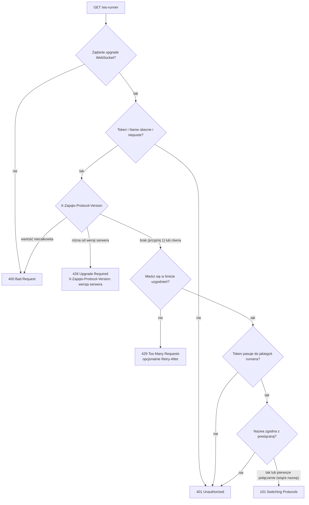
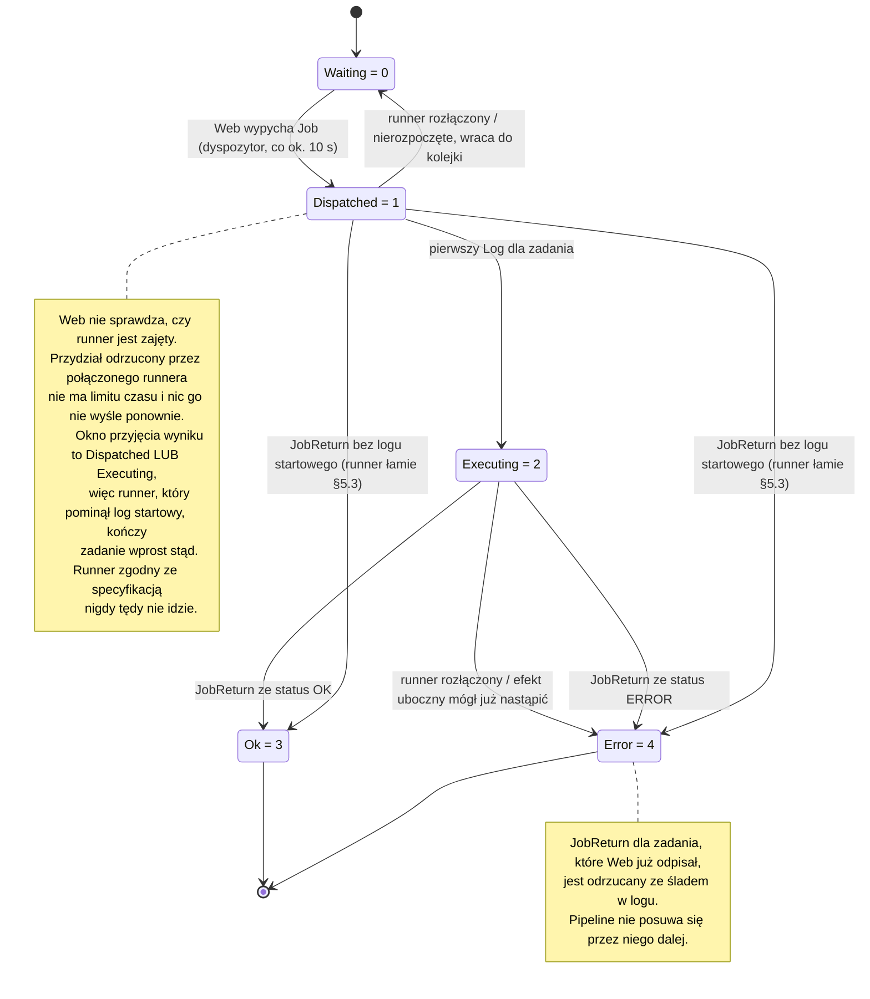
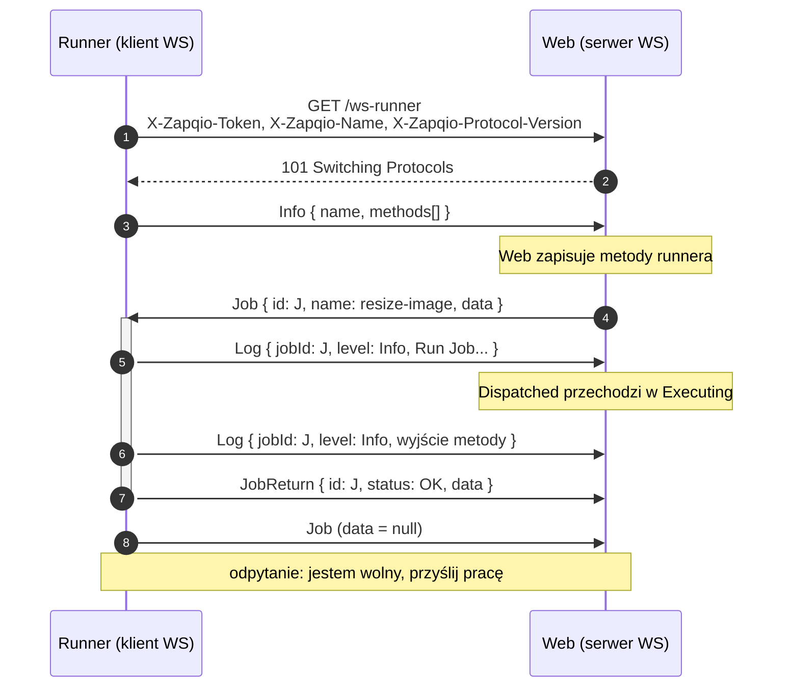

# Protokół Zapqio Runner — v1 (wersja robocza)

> **Uwaga.** Nazwy pól, nagłówków HTTP, typów wiadomości i wartości wyliczeń **nie są tłumaczone** —
> na łączu występują dokładnie w formie podanej w tym dokumencie.

To jest **źródło prawdy** dla protokołu komunikacji między serwerem **Web** Zapqio a **Runnerem**.
Każdy runner — w dowolnym języku — który jest zgodny z tym dokumentem, może połączyć się z Web.

Ta wersja ma charakter *opisowy*: dokumentuje zachowanie referencyjnej implementacji .NET wg stanu na
2026-08-04. §11 mapuje każdą regułę z tego dokumentu na kod, który ją realizuje, dzięki czemu
specyfikację można ponownie zweryfikować.

Słowa kluczowe MUSI, NIE WOLNO, POWINIEN oraz MOŻE są używane w rozumieniu RFC 2119 i odpowiadają
angielskim MUST, MUST NOT, SHOULD i MAY.

---

## 1. Przegląd

**Runner** jest **klientem** WebSocket. **Web** jest **serwerem** WebSocket. Runner nawiązuje
połączenie, uwierzytelnia się nagłówkami HTTP, ogłasza metody, które potrafi wykonać, a następnie
odbiera zadania, wykonuje je, strumieniuje logi i zwraca wyniki. Każda wiadomość aplikacyjna to
tekstowa ramka JSON o wspólnej [kopercie](#4-koperta).

Web jest **agnostyczny** wobec tego, jak runner wykonuje zadanie ani w jakim języku jest napisany.
Kieruje zadania według pary `(runner, nazwa metody)` i traktuje wejście oraz wyjście każdego zadania
jako **nieprzezroczysty ciąg znaków**. Runnery mogą być więc niejednorodne: jeden pipeline może mieć
kroki wykonywane przez różne runnery napisane w różnych językach.

Kompletna implementacja runnera to trzy warstwy, ale **tylko pierwsza przekracza granicę języka**:

1. **Protokół** — ten dokument. (Do zaimplementowania ponownie w Twoim języku.)
2. **Host** — cykl życia połączenia, pętla zadań, kolejka logów, kierowanie po nazwie metody.
3. **Model modułów** — sposób, w jaki *Twój* język definiuje i wykonuje metody. To projektujesz sam
   (np. dekoratory + generator JSON Schema). Model .NET oparty na `IRunnerMethod` i ładowaniu
   assembly **nie jest przenośny**; moduły są specyficzne dla języka.


| Nadawca | Odbiorca | Komunikat / Akcja | Szczegóły i zachowanie serwera |
|---|---|---|---|
| **Runner** | **Web** | Nawiązanie połączenia (`GET /ws-runner`) | Przesyła nagłówki: `X-Zapqio-Token`, `X-Zapqio-Name`. Zwraca kod `101` (lub błędy `400`/`401`/`426` — §3). |
| **Runner** | **Web** | `Info` (metody + nazwa) | Serwer rejestruje u siebie przesłane metody. |
| **Web** | **Runner** | `Job` (przydział) | Serwer aktywnie wypycha nowe zadanie do wykonania. |
| **Runner** | **Web** | `Log ... Log ...` | Strumieniowanie logów na żywo w trakcie wykonywania zadania. |
| **Runner** | **Web** | `JobReturn` (OK/ERROR + wynik) | Serwer zapisuje wynik i podaje go do kolejnego kroku. |
| **Runner** | **Web** | `Job` (odpytanie, `data=null`) | Klient zgłasza gotowość komunikatem „daj mi więcej pracy”. |


---

## 2. Transport i ramkowanie

- **WebSocket** (RFC 6455). Punkt końcowy: `GET {baseUrl}/ws-runner` ze standardowym upgrade, gdzie
  `{baseUrl}` to origin serwera Web (np. `wss://zapqio.example.com`).
- Wiadomości aplikacyjne to ramki **tekstowe**, **UTF-8**, każda będąca pojedynczym obiektem JSON
  (kopertą). Implementacje MUSZĄ scalać ramki kontynuacyjne aż do FIN przed parsowaniem.
- Maksymalny rozmiar wiadomości po stronie serwera: **32 MiB** (33 554 432 bajty). Większa wiadomość
  powoduje zamknięcie połączenia ze statusem WS **1009** (Message Too Big).
- Brak kompresji i grupowania (batching) na poziomie aplikacji.

---

## 3. Uzgadnianie połączenia i uwierzytelnianie

W żądaniu upgrade runner MUSI wysłać dwa nagłówki:

| Nagłówek | Znaczenie |
| --- | --- |
| `X-Zapqio-Token` | Sekretny token runnera, jawnym tekstem. Web weryfikuje go wobec zapisanych skrótów Argon2. |
| `X-Zapqio-Name`  | Stabilna, samodzielnie nadana nazwa runnera (z konfiguracji/zmiennej środowiskowej). |
| `X-Zapqio-Protocol-Version` | **Główna** wersja protokołu, którą mówi runner (np. `1`). Na razie opcjonalny; brak nagłówka jest traktowany jak `1`. |

Zachowanie serwera:

- Żądanie do `/ws-runner`, które **nie** jest upgrade WebSocket → HTTP **400**.
- Brakujący lub pusty którykolwiek z nagłówków → HTTP **401**.
- Token niepasujący do **żadnego** runnera → HTTP **401**.
- **Powiązanie nazwy:** przy pierwszym połączeniu Web wiąże `X-Zapqio-Name` z rekordem runnera. Przy
  kolejnych połączeniach nazwa MUSI być równa nazwie powiązanej, w przeciwnym razie → HTTP **401**.
- Nieobsługiwana wersja protokołu → HTTP **426 Upgrade Required** (odpowiedź niesie
  `X-Zapqio-Protocol-Version: <wersja serwera>`); wersja niebędąca liczbą całkowitą → HTTP **400**.
- **Ograniczenie tempa:** serwer MOŻE odrzucić uzgadnianie z HTTP **429 Too Many Requests**, zanim
  sprawdzi token. Sprawdzenie tokenu jest kosztowne, a endpoint jest anonimowy, więc serwer chroni
  się przed zalewem uzgodnień. Odpowiedź MOŻE nieść nagłówek `Retry-After` z liczbą sekund. Progi i
  sposób ich liczenia są sprawą serwera i nie są częścią protokołu.
- W pozostałych przypadkach → **101 Switching Protocols**.

Kolejność, w jakiej serwer sprawdza te warunki. Negocjacja wersji wypada przed wyszukaniem tokenu,
więc runner mówiący niewspieraną wersją zostaje odprawiony, zanim Web sięgnie po dane runnerów;
ograniczenie tempa stoi między nimi, bo to sprawdzenie tokenu jest tym drogim krokiem, który ma
chronić:



Uwagi:

- **Token jest tożsamością i sekretem**; **nazwa jest stabilną etykietą**. Wybierz nazwę raz i
  utrzymuj ją niezmienną. (Runner referencyjny odczytuje `ZAPQIO_NAME`, a jeśli nic nie
  skonfigurowano, generuje UUID i zapisuje go trwale do pliku `##Name`.)
- **Wersja protokołu** jest negocjowana nagłówkiem `X-Zapqio-Protocol-Version` (całkowita wersja
  główna). **Brak** nagłówka → przyjmuje się `1` (poziom bazowy sprzed wersjonowania); wartość
  **niecałkowita** → HTTP 400; wartość, której serwer **nie** obsługuje → **426 Upgrade Required**,
  z wersją serwera odesłaną w nagłówku odpowiedzi `X-Zapqio-Protocol-Version`. Wersja główna jest
  podnoszona wyłącznie przy zmianie łamiącej zgodność (§9).
- **429 znaczy „spróbuj później"**, a nie „tożsamość odrzucona" — serwer nie doszedł nawet do tokenu,
  więc odmowa nic o nim nie mówi. Runnerowi NIE WOLNO ponawiać uzgadniania w ciasnej pętli: POWINIEN
  odczekać czas podany w `Retry-After`, a gdy nagłówka nie ma — wycofywać się narastająco. Ponawianie
  bez zwłoki utrzymuje ograniczenie w stanie zadziałania i opóźnia powrót pozostałych runnerów, w tym
  jego własny.

---

## 4. Koperta

Każda wiadomość WebSocket to dokładnie taki obiekt:

```json
{ "type": "Job", "data": "…" }
```

- **`type`** *(string, wymagane)* — typ wiadomości: jeden z `Info`, `Job`, `JobReturn`, `Log`.
  Dokładna wielkość liter w §6.
- **`data`** *(string lub null, wymagane)* — ładunek dla danego typu, **zakodowany jako JSON w
  postaci ciągu znaków**. Obiekt ładunku jest serializowany do JSON, a ten *tekst* JSON trafia do
  `data` jako wartość tekstowa. `null` wyłącznie dla [odpytania Job](#52-job).

> **⚠ PUŁAPKA — podwójne kodowanie.** `data` jest **ciągiem znaków**, a nie zagnieżdżonym obiektem.
> Aby **odczytać** wiadomość: sparsuj kopertę, a następnie sparsuj `data` *ponownie* jako JSON. Aby
> **zapisać**: zserializuj ładunek do ciągu znaków i przypisz go do `data`. Rozpisane bajty w §8.

Wszystkie nazwy właściwości obiektów są w **camelCase** (`type`, `data`, `id`, `name`, `jobId`,
`level`, …).

---

## 5. Wiadomości i przepływ

Legenda kierunków: **R→W** runner→web, **W→R** web→runner.

### 5.1 Info (R→W)

Wysyłane **raz**, zaraz po pierwszym udanym połączeniu. Ogłasza nazwę runnera oraz metody, które
udostępnia. Ładunek — `MessageInfo`:

```json
{
  "name": "build-agent-01",
  "methods": [
    { "name": "resize-image", "in": "{\"type\":\"object\", … }", "out": "{\"type\":\"object\", … }" }
  ]
}
```

- `name` — nazwa runnera (ta sama wartość co `X-Zapqio-Name`).
- `methods` — tablica obiektów `MessageMethod`:
  - `name` — nazwa metody; zadania są do niej kierowane po tej nazwie.
  - `in`  — **JSON Schema** opisujący **wejście** metody, przenoszony *jako ciąg znaków*, albo `null`.
  - `out` — **JSON Schema** opisujący **wyjście** metody, przenoszony *jako ciąg znaków*, albo `null`.

Web zapisuje listę metod; interfejs użytkownika używa `in`/`out` do renderowania i walidacji wejścia
oraz wyjścia zadań w pipeline. Runner referencyjny wysyła `Info` raz na proces; **wyślij `Info`
ponownie, jeśli zmieni się zestaw metod** (np. po ponownym połączeniu z innym zestawem modułów).

### 5.2 Job

`Job` jest **przeciążony kierunkiem**:

- **Odpytanie (R→W):** koperta `{ "type": "Job", "data": null }`. Oznacza *„jestem wolny, przyślij mi
  pracę”*. Jeśli Web nie ma nic do przydzielenia, nie odsyła nic.
- **Przydział (W→R):** ładunek — `MessageJob`:

  ```json
  { "id": "a1b2c3d4-e5f6-7890-abcd-ef1234567890", "name": "resize-image", "data": "{\"width\":800}" }
  ```

  - `id`   — unikalny identyfikator zadania; odeślij go w `Log` i `JobReturn`.
  - `name` — która metoda ma zostać uruchomiona (pasuje do `MessageMethod.name`).
  - `data` — **wejście** zadania: samo w sobie ciąg znaków JSON (zgodny ze schematem `in` metody),
    możliwe że pusty.

> **⚠ PUŁAPKA — potrójne zagnieżdżenie.** `envelope.data` jest ciągiem znaków zawierającym JSON
> obiektu `MessageJob`, a `MessageJob.data` jest *znowu* ciągiem znaków zawierającym JSON wejścia
> zadania. To dwa poziomy kodowania tekstowego ponad samą ramką.

**Rozruch i kadencja.** Po `Info` runner blokuje się na odbiorze; **pierwsze** zadanie przychodzi z
dyspozytora działającego w tle po stronie Web, który rusza 30 s po starcie Web, a potem chodzi co
ok. 10 s. Runner wykonuje **jedno zadanie naraz** i po zakończeniu każdego zadania wysyła
**odpytanie Job**, aby pobrać kolejne.

Web przydziela zadania na tym timerze, nie sprawdzając, czy runner jest zajęty, więc przydział MOŻE
nadejść, gdy runner wciąż pracuje nad poprzednim zadaniem. Runnerowi **NIE WOLNO** go odrzucić —
musi zakolejkować go u siebie i wykonać, gdy zwolni się miejsce. Przydzielone zadanie jest już
zarezerwowane po stronie serwera (jest w stanie *Dispatched*, §5.3), a Web zwraca takie zadanie do
kolejki dopiero wtedy, gdy zniknie połączenie runnera; dla zadania przydzielonego runnerowi, który
pozostaje połączony, nie ma żadnego limitu czasu. Przydział odrzucony przez połączonego runnera
zostaje więc porzucony — nic go nie wyśle ponownie, nic go nie zakończy błędem, a on blokuje resztę
swojego uruchomienia pipeline'u. Runner referencyjny przestaje czytać gniazdo na czas wykonywania
metody, więc przydział, który nadejdzie w międzyczasie, czeka w buforze gniazda i zostaje wykonany,
gdy runner się zwolni.

### 5.3 Log (R→W)

Strumieniowane w trakcie wykonywania zadania. Ładunek — `MessageLog`:

```json
{
  "jobId": "a1b2c3d4-e5f6-7890-abcd-ef1234567890",
  "level": "Info",
  "message": "Run Job: 2026-06-12T14:30:00",
  "date": "2026-06-12T14:30:00.123+00:00"
}
```

- `jobId`   — zadanie, do którego należy dany wpis logu.
- `level`   — `Info` albo `Error` (§6).
- `message` — treść logu.
- `date`    — znacznik czasu ISO-8601 z przesunięciem strefy czasowej (§7).

**Pierwszy** `Log` dla zadania przełącza je po stronie serwera ze stanu *Dispatched* na *Executing*.
To przejście decyduje o tym, jak odzyskiwane jest zadanie utracone: jeśli runner rozłączy się bez
wysłania `JobReturn`, zadanie wciąż w stanie *Dispatched* uznaje się za nierozpoczęte i wraca ono do
kolejki, natomiast zadanie już w *Executing* kończy się błędem zamiast zostać uruchomione ponownie —
jego efekt uboczny mógł już nastąpić.

Runner MUSI zatem wysłać wiersz startowy `Log` **przed** wywołaniem metody i MUSI wysłać go
natychmiast, z pominięciem swojego bufora logów. Runner, który buforuje wiersz startowy, może wykonać
efekt uboczny i ulec awarii przed kolejnym opróżnieniem kolejki; zadanie zostanie wtedy w stanie
*Dispatched*, a Web wykona je po raz drugi.

Runner referencyjny przechwytuje `stdout` metody→`Info` oraz `stderr`→`Error`, a także ów wiersz
startowy i ewentualny wyjątek. Wiersz startowy jest wysyłany synchronicznie, przed wywołaniem;
pozostałe wpisy są opróżniane z kolejki na timerze co ok. 2 s, **jedna wiadomość WS na wpis**.

### 5.4 JobReturn (R→W)

Wysyłane **raz**, gdy zadanie się zakończy. Ładunek — `MessageJobReturn`:

```json
{ "id": "a1b2c3d4-e5f6-7890-abcd-ef1234567890", "status": "OK", "data": "{\"url\":\"…\"}" }
```

- `id`     — identyfikator zadania.
- `status` — `OK` albo `ERROR` (§6).
- `data`   — przy `OK`: **wyjście** zadania (ciąg znaków JSON zgodny z `out`), które Web podaje jako
  **wejście kolejnego kroku pipeline**. Przy `ERROR`: `null`.

Web przyjmuje wynik tylko wtedy, gdy zadanie jest wciąż w stanie *Dispatched* albo *Executing*, i
tylko od tego runnera, któremu je przydzielono. Wynik zadania, na którym Web już postawił krzyżyk —
zakolejkowanego ponownie albo zakończonego błędem z powodu utraty runnera (§5.3) — zostaje
**odrzucony**, ze śladem w logu zadania; uruchomienie pipeline'u nie posuwa się przez niego dalej.
Runner nie może więc zakładać, że `JobReturn`, który udało mu się wypchnąć na łącze, został
uwzględniony, a ponowne wysłanie wyniku po wznowieniu połączenia nie odzyskuje zadania, które Web
już odpisał.

Cykl życia zadania po stronie Web, złożony z reguł §5.2–5.4. Etykiety stanów to wartości
`RunnerJobStatus` wraz z numerem, pod którym są utrwalane:



### 5.5 Typowa wymiana (połączenie i jedno zadanie)



---

## 6. Wyliczenia (dokładne wartości na łączu)

Wyliczenia są serializowane jako ich **dokładne nazwy** — implementacja referencyjna używa konwertera
wyliczeń na ciągi znaków **bez polityki nazewnictwa**, więc wartości są w **PascalCase / wielkimi
literami, a NIE w camelCase**. Producenci MUSZĄ emitować dokładnie te ciągi:

| Pole | Dozwolone wartości |
| --- | --- |
| `type` wiadomości  | `Info`, `Job`, `JobReturn`, `Log` |
| `level` w Log      | `Info`, `Error` |
| `status` w JobReturn | `OK`, `ERROR` |

Referencyjny *deserializator* .NET akceptuje przy odczycie także inną wielkość liter oraz wartości
całkowite, ale zgodny producent MUSI emitować dokładnie powyższe ciągi i NIE WOLNO mu emitować
liczb całkowitych.

---

## 7. Formaty skalarne

| Typ logiczny | Format na łączu | Przykład |
| --- | --- | --- |
| uuid (`id`, `jobId`) | kanoniczny UUID z myślnikami, małymi literami | `"a1b2c3d4-e5f6-7890-abcd-ef1234567890"` |
| znacznik czasu (`date`) | ISO-8601 z przesunięciem strefy czasowej; ułamki sekund opcjonalne | `"2026-06-12T14:30:00.123+00:00"` |
| JSON Schema (`in`, `out`) | dokument JSON Schema przenoszony **jako ciąg znaków** | `"{\"type\":\"object\", … }"` |
| wejście/wyjście zadania (`data` w `MessageJob`/`MessageJobReturn`) | nieprzezroczysty JSON przenoszony **jako ciąg znaków**; kształt definiowany per metoda przez `in`/`out`, a nie przez ten protokół | `"{\"width\":800}"` |

---

## 8. Przykład krok po kroku — bajty na łączu

**Przydział Job** dla metody `resize-image` z wejściem `{"width":800,"height":600}`. Dokładna ramka
tekstowa, którą wysyła Web:

```
{"type":"Job","data":"{\"id\":\"a1b2c3d4-e5f6-7890-abcd-ef1234567890\",\"name\":\"resize-image\",\"data\":\"{\\\"width\\\":800,\\\"height\\\":600}\"}"}
```

Dekodowanie, poziom po poziomie:

1. **Ramka → koperta:** `{ "type": "Job", "data": "{\"id\":\"a1b2…\",\"name\":\"resize-image\",\"data\":\"{\\\"width\\\":800,…}\"}" }`
2. **Parsowanie `data` → `MessageJob`:** `{ "id": "a1b2…", "name": "resize-image", "data": "{\"width\":800,\"height\":600}" }`
3. **Parsowanie `MessageJob.data` → wejście:** `{ "width": 800, "height": 600 }`

Każdy fixture w katalogu [`fixtures/`](./fixtures/) to jedna taka dokładna ramka.

---

## 9. Wersjonowanie i zgodność

- To jest **v1**, opisowa wobec bieżącej implementacji referencyjnej.
- **Negocjacja wersji** odbywa się podczas uzgadniania połączenia przez nagłówek
  `X-Zapqio-Protocol-Version` (§3): runner wysyła swoją wersję główną, a serwer akceptuje wyłącznie
  wersje, które obsługuje, odpowiadając w przeciwnym razie **426 Upgrade Required**. Brak nagłówka
  jest traktowany jak `1` dla zgodności wstecznej z runnerami sprzed wersjonowania.
- Zasady zgodności dla przyszłych rewizji: dodanie pola **opcjonalnego** jest zgodne wstecz;
  usunięcie lub zmiana nazwy pola, albo zmiana ciągu wyliczenia, **łamie zgodność** i wymaga
  podniesienia wersji.
- Nowy **kod odrzucenia** uzgadniania nie łamie zgodności i nie podnosi wersji głównej — tak samo
  weszło **429** (§3). Runner POWINIEN więc traktować każdy nieznany status inny niż 101 jako odmowę
  i wycofać się narastająco, zamiast ponawiać natychmiast albo uznać połączenie za nawiązane.

---

## 10. Zgodność ze specyfikacją

Implementacja jest zgodna, jeżeli potrafi zarówno **wyprodukować**, jak i **skonsumować** każdy
fixture z katalogu [`fixtures/`](./fixtures/) w taki sposób, że po pełnym zdekodowaniu (ramka →
koperta → ładunek → zagnieżdżone wejście/wyjście zadania) zawartość logiczna jest równa zawartości
udokumentowanej dla danego fixture'a.

Porównanie jest **semantyczne** (sparsowane struktury są głęboko równe), a **nie bajt w bajt**:
nieznaczące białe znaki i kolejność kluczy w obiektach nie mają znaczenia. Producenci POWINNI mimo to
emitować wielkość liter w nazwach pól oraz ciągi wyliczeń dokładnie tak, jak określono, ponieważ nie
każdy konsument jest pobłażliwy.

---

## 11. Mapa implementacji referencyjnej

Ten dokument, wraz z [`schemas.json`](./schemas.json) i [`fixtures/`](./fixtures/), jest źródłem
prawdy: kod .NET jest **jedną** z implementacji, a nie definicją protokołu.

Reguły **łącza** są sprawdzane automatycznie. Oba wiązania .NET — `Zapqio.Runner.Protocol` w runnerze
referencyjnym i `Zapqio.Protocol` w Web — mają zestaw testów zgodności, który konsumuje i produkuje
każdy fixture oraz waliduje ładunki wobec `schemas.json`, czytając te pliki, a nie kopię ich treści.
Zmieniona nazwa pola, inna wartość wyliczenia albo zgubiona warstwa kodowania kończy się tam błędem.
Reguły **zachowania** nie są objęte tymi testami: uzgadnianie połączenia i jego kody odrzucenia (§3),
cykl życia zadania (§5.2), wymóg logu przed wywołaniem (§5.3) oraz okno przyjmowania wyniku (§5.4) są
weryfikowane wyłącznie przeglądem kodu, więc każdą rozbieżność między kodem a specyfikacją w tych
punktach traktuj jako błąd wart zgłoszenia, a nie jako stan uzgodniony.

Runner referencyjny jest **klientem** WebSocket i znajduje się w `github.com/zapqio/runner-dotnet`.
Jego układ, dla czytelników, którzy chcą zobaczyć daną regułę w działającym kodzie — Web ma własne
wiązanie tych samych typów wiadomości w `Zapqio.Protocol`:

| Zagadnienie | Plik |
| --- | --- |
| Koperta + opcje JSON (camelCase, wyliczenia jako ciągi) | `Zapqio.Runner.Protocol/Message.cs`, `Zapqio.Runner.Protocol/JsonDefaults.cs` |
| Kształty ładunków | `Zapqio.Runner.Protocol/Message{Info,Method,Job,JobReturn,Log}.cs` |
| Definicje wyliczeń | `Zapqio.Runner.Protocol/Enums/Message{Type,LogLevel,ResponseStatus}.cs` |
| Stała negocjowanej wersji | `Zapqio.Runner.Protocol/ProtocolVersion.cs` |
| Zestaw testów zgodności (fixture'y + schematy) | `Zapqio.Runner.Protocol.Tests/` |
| Uzgadnianie połączenia i wysyłka (klient) | `Zapqio.Runner/WSClient.cs` |
| Pętla runnera (Info, odpytanie, przydział) | `Zapqio.Runner/Background/RequestBindBackground.cs` |
| Kolejka logów i kadencja opróżniania | `Zapqio.Runner/Background/SendLogsBackground.cs`, `Zapqio.Runner/LogQueue.cs`, `Zapqio.Runner/ScopedConsole.cs` |

Strona **serwera** (Web) nie jest częścią tego repozytorium. Wszystko, czego runner potrzebuje do
współpracy z nim, jest określone tutaj: uzgadnianie połączenia i jego kody odrzucenia (§3), koperta
(§4), zestaw wiadomości i ich kierunki (§5) oraz zasady negocjacji wersji (§9). Nie wolno polegać na
żadnym zachowaniu serwera wykraczającym poza ten dokument.
